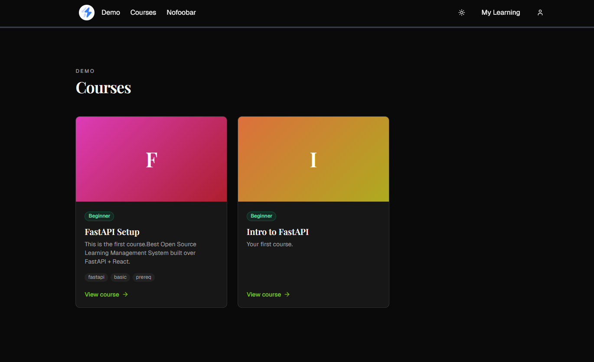

# nofoobar
Live Demo [FastAPITutorial](https://fastapitutorial.com/).


Open-source, multi-tenant learning management system for course creators.

## Tech stack

- **Backend** — FastAPI + SQLModel + PostgreSQL (async), Alembic migrations, sqladmin operator console
- **Frontend** — Next.js 16 (App Router), React 19, Tailwind, shadcn primitives + curated Magic UI
- **License** — Apache 2.0


## Quickstart

### Backend

```bash
cd backend
cp .env.example .env
docker compose up --build
docker compose exec web uv run alembic upgrade head
```
- Admin console → http://localhost:8000/admin (default `admin` / `changeme` — change in `.env`)

### Frontend

```bash
cd frontend
pnpm install
pnpm dev
```
- App → http://localhost:3000


## More

- [`backend/README.md`](backend/README.md) — backend conventions, migrations, common commands
- [`frontend/README.md`](frontend/README.md) — frontend conventions, UI policy
- [`docs/local-setup/dev-subdomains.md`](docs/local-setup/dev-subdomains.md) — testing tenant subdomains on a local machine
- [`CLAUDE.md`](CLAUDE.md) — orientation for Claude Code sessions
- [`docs/`](docs/) — deeper architecture / devops notes (work in progress)
